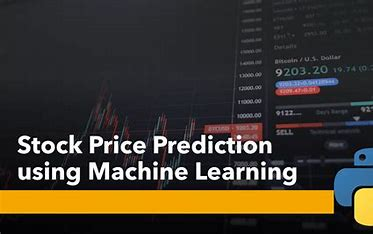
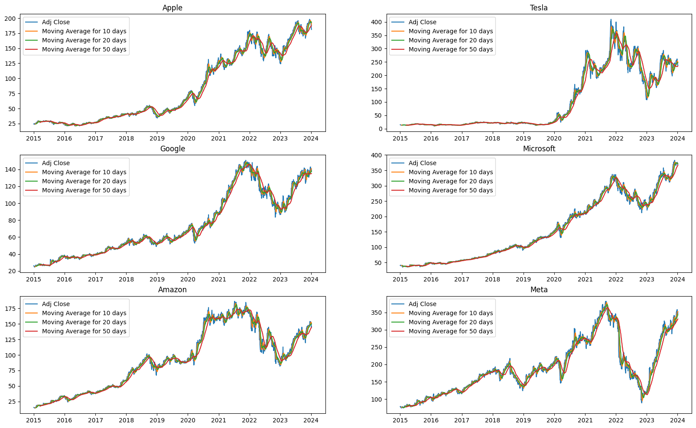
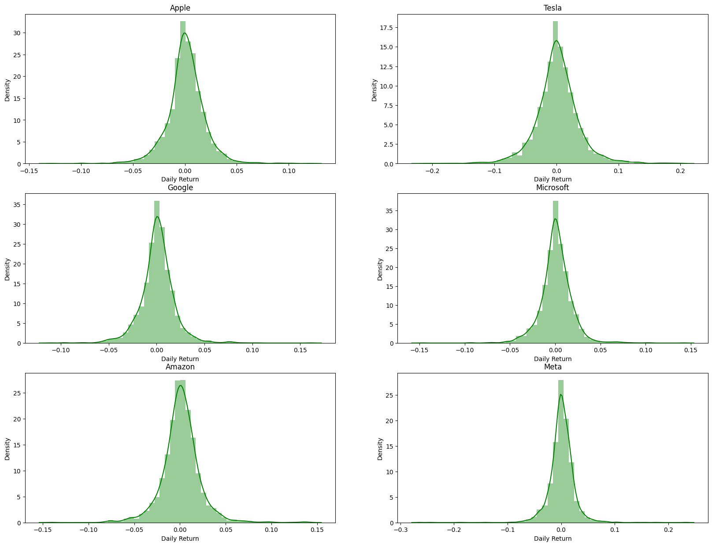
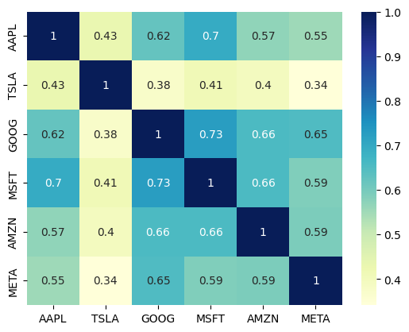
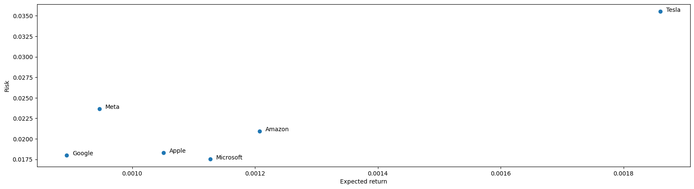

# Stock Price Prediction
 

## Project Overview

This passage discusses the use of financial models and machine learning in predicting stock prices. Investment firms, hedge funds, and individuals use historical stock prices and company performance data to build machine-learning algorithms for understanding market behavior and making profitable investments. While some believe that stock prices are random and unpredictable, top firms still hire quantitative analysts to build predictive models. The prevalence of software-driven orders on Wall Street and the increasing presence of machine-learning experts highlight the shift toward algorithm-based trading.

## Dataset
Website of data https://in.finance.yahoo.com 

## Exploratory Data Analysis

### Closing Price v/s Time
 

We can see from the above graph that Telsa shares have tremendous growth in the 2020-2021 period.
 
If we follow the news, it can be due to

1. Emission Credit Sales
2. Tesla entering the Fast-Growing Compact SUV Market
3. Starting production in China

For the rest of the Companies, we can see that COVID-19 is the primary factor affecting the 2020-2021 period.
 

### Histogram plot of Percentage Daily Return 
 

### Correlation between the stocks daily returns
 

 
From the above plot, we can see that Microsoft and Google had the strongest correlation in stocks daily returns.

### Risk v/s Expected Returns
 

 
From the above graph, we can see that Tesla has the highest expected returns and the highest risk factor. Google has the lowest expected returns and the lowest risk factor.

 

## Predicting the closing stock price of the 6 companies

 

**Amazon**

**Meta**

**Microsoft**

**Apple**

**Tesla**

**Google**

## References
1. Stock Price Prediction Using Machine Learning and LSTM-Based Deep Learning Models. [[2009.10819\] Stock Price Prediction Using Machine Learning and LSTM-Based Deep Learning Models (arxiv.org)](https://arxiv.org/abs/2009.10819)
1. Stock Market Forecasting Using Time Series Analysis. [Stock Market Forecasting Using Time Series Analysis - KDnuggets](https://www.kdnuggets.com/2020/01/stock-market-forecasting-time-series-analysis.html)

 

## How to reach me:

**Mail** : mohamed.essam42001@gmail.com

**LinkedIn** : [(2) Mohamed Essam | LinkedIn](https://www.linkedin.com/in/mohamed-essam-16781421a/)

**WhatsApp**: +201023432360

